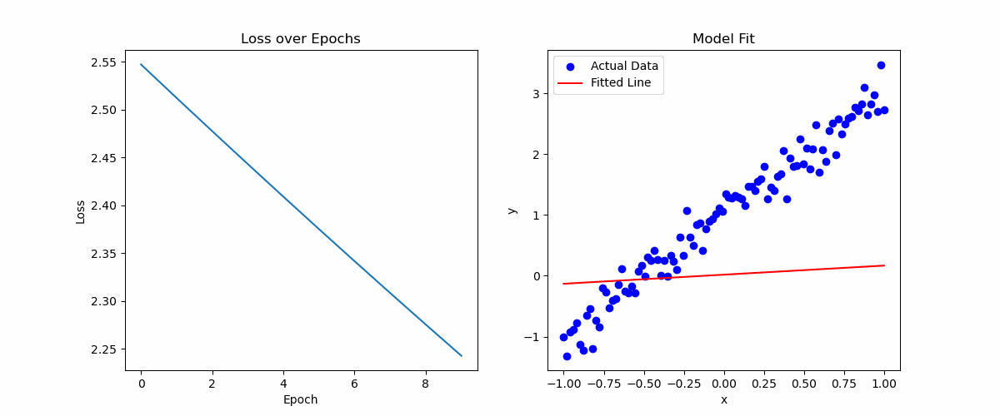
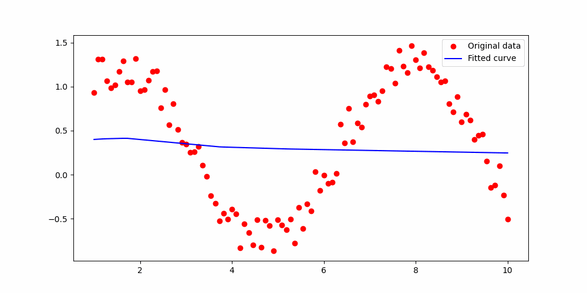
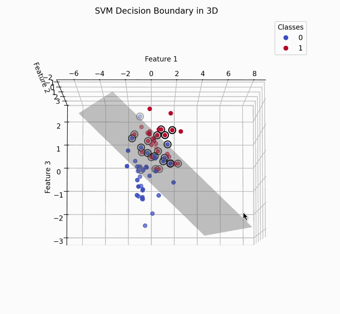

# Python & R Machine Learning

- [Python & R Machine Learning](#python--r-machine-learning)
  - [R Machine Learning](https://github.com/chanshunli/jim-emacs-machine-learning/tree/master/R-Lang-machine-learning)
  - [kmeans](#kmeans)
  - [least squares method](#least-squares-method)
  - [least squares method by neural network](#least-squares-method-by-neural-network)
  - [nonlinear fitting](#nonlinear-fitting)
  - [polar coordinate classification](#polar-coordinate-classification)
  - [Data cleaning](#data-cleaning)
  - [mnist ocr](#mnist-ocr)
  - [use mnist](#use-mnist)
  - [calculator neural network](#calculator-neural-network)

## least squares method

```python
import numpy as np
import matplotlib.pyplot as plt

# Example data points
X = np.array([1, 2.2, 3, 4, 5])
y = np.array([2, 4, 6.3, 8, 11])

# Add a column of ones to X for the intercept term (bias)
X_b = np.c_[np.ones((X.shape[0], 1)), X]  # X_b is X with a bias column

# Calculate the best fit line parameters using the Normal Equation
theta_best = np.linalg.inv(X_b.T.dot(X_b)).dot(X_b.T).dot(y)

# Print the parameters (intercept and slope)
print(f"Intercept: {theta_best[0]}")
print(f"Slope: {theta_best[1]}")

# Predict values using the model
y_pred = X_b.dot(theta_best)

# Plot the data points and the best fit line
plt.scatter(X, y, color='blue', label='Data points')
plt.plot(X, y_pred, color='red', label='Best fit line')
plt.xlabel('X')
plt.ylabel('y')
plt.legend()
plt.show()
```

## least squares method by neural network



```python
import torch
import torch.nn as nn
import torch.optim as optim
import matplotlib.pyplot as plt

# graph show the  pytorch torch.optim.Adam and plot it How it works

# Define a simple linear model
class LinearModel(nn.Module):
    def __init__(self):
        super(LinearModel, self).__init__()
        self.linear = nn.Linear(1, 1)

    def forward(self, x):
        return self.linear(x)

# Initialize the model, loss function, and optimizer
model = LinearModel()
criterion = nn.MSELoss()
optimizer = optim.Adam(model.parameters(), lr=0.01)

# Generate some synthetic data (y = 2x + 1 with some noise)
x_train = torch.linspace(-1, 1, 100).reshape(-1, 1)
y_train = 2 * x_train + 1 + 0.2 * torch.randn(x_train.size())

# List to store the loss values
loss_values = []

# Training loop
for epoch in range(1000):
    model.train()
    optimizer.zero_grad()
    outputs = model(x_train)
    loss = criterion(outputs, y_train)
    loss.backward()
    optimizer.step()
    loss_values.append(loss.item())
```

## nonlinear fitting




```python
import torch
import torch.nn as nn
import numpy as np
import matplotlib.pyplot as plt

# Step 1: Generate a 100-length random sequence
n = 100
x = torch.linspace(1, 10, n).unsqueeze(1)
y = torch.sin(x) + torch.rand(n, 1) * 0.5

# Step 2: Define a simple neural network model for nonlinear fitting
class NonlinearModel(nn.Module):
    def __init__(self):
        super(NonlinearModel, self).__init__()
        self.fc1 = nn.Linear(1, 10)
        self.fc2 = nn.Linear(10, 10)
        self.fc3 = nn.Linear(10, 1)

    def forward(self, x):
        x = torch.relu(self.fc1(x))
        x = torch.relu(self.fc2(x))
        x = self.fc3(x)
        return x

model = NonlinearModel()

# Step 3: Define loss function and optimizer
criterion = nn.MSELoss()
optimizer = torch.optim.Adam(model.parameters(), lr=0.01)

# Step 4: Train the model
epochs = 1000
for epoch in range(epochs):
    model.train()

    # Forward pass
    outputs = model(x)
    loss = criterion(outputs, y)

    # Backward pass and optimization
    optimizer.zero_grad()
    loss.backward()
    optimizer.step()

    if (epoch+1) % 100 == 0:
        print(f'Epoch [{epoch+1}/{epochs}], Loss: {loss.item():.4f}')

# Step 5: Plot the original data and the fitted curve
model.eval()
with torch.no_grad():
    predicted = model(x).numpy()

plt.figure(figsize=(10, 5))
plt.plot(x.numpy(), y.numpy(), 'ro', label='Original data')
plt.plot(x.numpy(), predicted, 'b-', label='Fitted curve')
plt.legend()
plt.show()

```
## polar coordinate classification


```python
import torch
import torch.nn as nn
import torch.optim as optim
from torch.utils.data import DataLoader, TensorDataset
import matplotlib.pyplot as plt
from mpl_toolkits.mplot3d import Axes3D

# Helper function to convert Cartesian to Polar coordinates
def cartesian_to_polar(x, y, z):
    r = torch.sqrt(x**2 + y**2 + z**2)
    theta = torch.atan2(y, x)
    phi = torch.acos(z / r)
    return r, theta, phi

# Example data generation (replace with your actual data)
n_samples = 5000
x = torch.randn(n_samples)
y = torch.randn(n_samples)
z = torch.randn(n_samples)
labels = torch.randint(0, 4, (n_samples,))  # Four classes (0, 1, 2, 3)

# Convert to polar coordinates
r, theta, phi = cartesian_to_polar(x, y, z)

# Combine into a single tensor
data = torch.stack((r, theta, phi), dim=1)

# Create a Dataset and DataLoader
dataset = TensorDataset(data, labels)
train_loader = DataLoader(dataset, batch_size=32, shuffle=True)

# Define a simple feedforward neural network
class PolarNet(nn.Module):
    def __init__(self):
        super(PolarNet, self).__init__()
        self.fc1 = nn.Linear(3, 64)
        self.fc2 = nn.Linear(64, 128)
        self.fc3 = nn.Linear(128, 4)  # Four output classes

    def forward(self, x):
        x = torch.relu(self.fc1(x))
        x = torch.relu(self.fc2(x))
        x = self.fc3(x)
        return x

# Initialize the model, loss function, and optimizer
model = PolarNet()
criterion = nn.CrossEntropyLoss()
optimizer = optim.Adam(model.parameters(), lr=0.001)

# Training loop
for epoch in range(20):  # Number of epochs
    for inputs, targets in train_loader:
        # Forward pass
        outputs = model(inputs)
        loss = criterion(outputs, targets)

        # Backward pass and optimization
        optimizer.zero_grad()
        loss.backward()
        optimizer.step()

    print(f'Epoch {epoch+1}/20, Loss: {loss.item()}')

# After training, evaluate the model on the entire dataset for visualization
with torch.no_grad():
    predicted_labels = model(data).argmax(dim=1)

# Plotting the results in 3D
fig = plt.figure()
ax = fig.add_subplot(111, projection='3d')

# Convert polar back to Cartesian for plotting
x_cartesian = r * torch.sin(phi) * torch.cos(theta)
y_cartesian = r * torch.sin(phi) * torch.sin(theta)
z_cartesian = r * torch.cos(phi)

# Plot the 3D scatter plot
scatter = ax.scatter(x_cartesian, y_cartesian, z_cartesian, c=predicted_labels, cmap='viridis', marker='o')

# Add color bar and labels
plt.colorbar(scatter, ax=ax)
ax.set_xlabel('X')
ax.set_ylabel('Y')
ax.set_zlabel('Z')
plt.title('3D Visualization of PolarNet Classifications')
plt.show()
```

## mnist ocr

```python
import torch
import torch.nn as nn
import torch.optim as optim
import torch.nn.functional as F
from torchvision import datasets, transforms
from torch.utils.data import DataLoader

batch_size = 64
learning_rate = 0.01
epochs = 100
transform = transforms.Compose([
    transforms.ToTensor(),
    transforms.Normalize((0.1307,), (0.3081,))
])
train_dataset = datasets.MNIST(root='./data', train=True, download=True, transform=transform)
test_dataset = datasets.MNIST(root='./data', train=False, download=True, transform=transform)
train_loader = DataLoader(dataset=train_dataset, batch_size=batch_size, shuffle=True)
test_loader = DataLoader(dataset=test_dataset, batch_size=batch_size, shuffle=False)

class Net(nn.Module):
    def __init__(self):
        super(Net, self).__init__()
        self.fc1 = nn.Linear(28 * 28, 128)
        self.fc2 = nn.Linear(128, 64)
        self.fc3 = nn.Linear(64, 10)

    def forward(self, x):
        x = x.view(-1, 28 * 28)
        x = F.relu(self.fc1(x))
        x = F.relu(self.fc2(x))
        x = self.fc3(x)
        return x

model = Net()
criterion = nn.CrossEntropyLoss()
optimizer = optim.SGD(model.parameters(), lr=learning_rate)

for epoch in range(epochs):
    model.train()
    for batch_idx, (data, target) in enumerate(train_loader):
        optimizer.zero_grad()
        output = model(data)
        loss = criterion(output, target)
        loss.backward()
        optimizer.step()
        if batch_idx % 100 == 0:
            print(f'Epoch: {epoch+1}/{epochs} [Batch: {batch_idx*len(data)}/{len(train_loader.dataset)}] Loss: {loss.item():.6f}')

model.eval()
test_loss = 0
correct = 0

with torch.no_grad():
    for data, target in test_loader:
        output = model(data)
        test_loss += criterion(output, target).item()
        pred = output.argmax(dim=1, keepdim=True)
        correct += pred.eq(target.view_as(pred)).sum().item()

test_loss /= len(test_loader.dataset)
accuracy = 100. * correct / len(test_loader.dataset)
print(f'Test set: Average loss: {test_loss:.4f}, Accuracy: {correct}/{len(test_loader.dataset)} ({accuracy:.2f}%)')
torch.save(model.state_dict(), "mnist_model.pth")

```
## use mnist

```python
model = Net()
### 3. Load the Trained Model Weights
model.load_state_dict(torch.load("mnist_model.pth"))
model.eval()  # Set the model to evaluation mode

### 4. Prepare the Handwritten Input Image
#You need to preprocess the handwritten image to match the format of the MNIST dataset (28x28 pixels, grayscale).
def preprocess_image(image_path):
    transform = transforms.Compose([
        transforms.Grayscale(),  # Ensure the image is grayscale
        transforms.Resize((28, 28)),  # Resize to 28x28 pixels
        transforms.ToTensor(),  # Convert to tensor
        transforms.Normalize((0.1307,), (0.3081,))  # Normalize with the same mean and std as MNIST
    ])
    image = Image.open(image_path)
    image = transform(image).unsqueeze(0)  # Add batch dimension
    return image

### 5. Perform Inference
def recognize_digit(image_path):
    image = preprocess_image(image_path)
    with torch.no_grad():
        output = model(image)
        prediction = output.argmax(dim=1, keepdim=True)
    return prediction.item()

# Example usage
image_path = 'path_to_your_handwritten_digit_image3.png'
predicted_digit = recognize_digit(image_path)
print(f'Predicted Digit: {predicted_digit}')

```

## calculator neural network

```python
import torch
import torch.nn as nn
import torch.optim as optim
import random
import numpy as np

# Define the neural network architecture
class CalculatorNN(nn.Module):
    def __init__(self):
        super(CalculatorNN, self).__init__()
        self.fc1 = nn.Linear(3, 128)  # Input: 2 numbers + operation
        self.fc2 = nn.Linear(128, 64)
        self.fc3 = nn.Linear(64, 1)   # Output: the result

    def forward(self, x):
        x = torch.relu(self.fc1(x))
        x = torch.relu(self.fc2(x))
        x = self.fc3(x)
        return x

model = CalculatorNN()
criterion = nn.MSELoss()
optimizer = optim.Adam(model.parameters(), lr=0.001)

# Training loop
num_epochs = 50000 # loss is too large if is 5000.
for epoch in range(num_epochs):
    model.train()
    # Forward pass
    predictions = model(X_train)
    loss = criterion(predictions, y_train)
    # Backward pass and optimization
    optimizer.zero_grad()
    loss.backward()
    optimizer.step()
    if (epoch + 1) % 10 == 0:
        print(f'Epoch [{epoch+1}/{num_epochs}], Loss: {loss.item():.4f}')

# ---- use
model = CalculatorNN()
model.load_state_dict(torch.load('calculator_model.pth'))
model.eval()


# Perform the prediction
with torch.no_grad():
    # Prepare the input (32 * 3)
    input_data = torch.tensor([[32.0, 3.0, 2]], dtype=torch.float32)  # 2 corresponds to multiplication
    prediction = model(input_data)
    print(f'Prediction for 32 * 3: {prediction.item():.4f}')

```

## Data cleaning
* [log clean utils](./log_utils.py)
```python
## split
def split_log_file(input_file, split_pattern, output_pattern):
    with open(input_file, 'r') as file:
        log_content = file.read()
    pattern = re.compile(split_pattern)
    split_points = [match.start() for match in re.finditer(pattern, log_content)]
    split_points.append(len(log_content))
    for i in range(len(split_points) - 1):
        start = split_points[i]
        end = split_points[i + 1]
        segment = log_content[start:end]
        match = pattern.search(segment)
        if match:
            number = match.group(1)
            output_file = output_pattern.format(number=number)
            with open(output_file, 'w') as file:
                file.write(segment)
            print(f"Segment saved as {output_file}")
## patterns
def move_patterns_logs(destination_path, patterns):
    current_directory = os.getcwd()
    log_files = glob.glob("*.log")
    for log_file in log_files:
        with open(log_file, 'r') as file:
            if any(re.search(pattern, line) for pattern in patterns for line in file):
                shutil.move(os.path.join(current_directory, log_file), destination_path)
                break

## filter show or data visualization
def filter_log_file(log_file_path, exclude_keywords):
    with open(log_file_path, "r") as file:
        lines = file.readlines()
    filtered_lines = [line for line in lines if not any(keyword in line for keyword in exclude_keywords)]
    for line in filtered_lines:
        print(line, end="")

```

## SVM

```python
import numpy as np
import matplotlib.pyplot as plt
from mpl_toolkits.mplot3d import Axes3D
from sklearn.datasets import make_classification
from sklearn.svm import SVC
from sklearn.preprocessing import StandardScaler
from sklearn.model_selection import train_test_split
X, y = make_classification(n_samples=100, n_features=3, n_informative=3, n_redundant=0, n_classes=2, random_state=42)
X_train, X_test, y_train, y_test = train_test_split(X, y, test_size=0.3, random_state=42)
scaler = StandardScaler()
X_train = scaler.fit_transform(X_train)
X_test = scaler.transform(X_test)
model = SVC(kernel='linear')
model.fit(X_train, y_train)
def plot_svm_decision_boundary_3d(model, X, y):
    fig = plt.figure(figsize=(10, 8))
    ax = fig.add_subplot(111, projection='3d')
    # Plot the training points
    scatter = ax.scatter(X[:, 0], X[:, 1], X[:, 2], c=y, s=30, cmap=plt.cm.coolwarm)
    # Create grid to evaluate model (this defines the 3D space)
    xlim = ax.get_xlim()
    ylim = ax.get_ylim()
    zlim = ax.get_zlim()
    xx = np.linspace(xlim[0], xlim[1], 20)
    yy = np.linspace(ylim[0], ylim[1], 20)
    zz = np.linspace(zlim[0], zlim[1], 20)
    # Create a meshgrid to evaluate the decision function
    YY, ZZ = np.meshgrid(yy, zz)
    XX = -(model.coef_[0][0] * YY + model.coef_[0][2] * ZZ + model.intercept_) / model.coef_[0][1]
    # Plot the decision surface
    ax.plot_surface(XX, YY, ZZ, color='gray', alpha=0.3, rstride=100, cstride=100)
    # Highlight support vectors
    ax.scatter(model.support_vectors_[:, 0], model.support_vectors_[:, 1], model.support_vectors_[:, 2],
               s=100, facecolors='none', edgecolors='k', linewidth=1.5, label='Support Vectors')
    ax.set_title('SVM Decision Boundary in 3D')
    ax.set_xlabel('Feature 1')
    ax.set_ylabel('Feature 2')
    ax.set_zlabel('Feature 3')
    # Add color legend
    legend1 = ax.legend(*scatter.legend_elements(), loc="best", title="Classes")
    ax.add_artist(legend1)
    plt.show()
plot_svm_decision_boundary_3d(model, X_train, y_train)
```

## kmeans
* [kmeans log analysis](./kmeans_log_analysis.py)

```python
from sklearn.feature_extraction.text import TfidfVectorizer
from sklearn.cluster import KMeans

def cluster_error_messages(error_messages, num_clusters=5):
    vectorizer = TfidfVectorizer(stop_words='english')
    X = vectorizer.fit_transform(error_messages)

    kmeans = KMeans(n_clusters=num_clusters, random_state=0)
    kmeans.fit(X)

    labels = kmeans.labels_
    clustered_errors = {}
    for i, label in enumerate(labels):
        if label not in clustered_errors:
            clustered_errors[label] = []
        clustered_errors[label].append(error_messages[i])
    return clustered_errors
```
## Decision Tree Classifier

```python
import matplotlib.pyplot as plt
from sklearn.datasets import load_iris
from sklearn.model_selection import train_test_split
from sklearn.tree import DecisionTreeClassifier, plot_tree
from sklearn import metrics
iris = load_iris()
X = iris.data  # Features
y = iris.target  # Labels
X_train, X_test, y_train, y_test = train_test_split(X, y, test_size=0.3, random_state=42)
clf = DecisionTreeClassifier()
clf.fit(X_train, y_train)
y_pred = clf.predict(X_test)
accuracy = metrics.accuracy_score(y_test, y_pred)
print(f"Accuracy: {accuracy * 100:.2f}%")
plt.figure(figsize=(12,8))
plot_tree(clf, feature_names=iris.feature_names, class_names=iris.target_names, filled=True)
plt.show()
```
